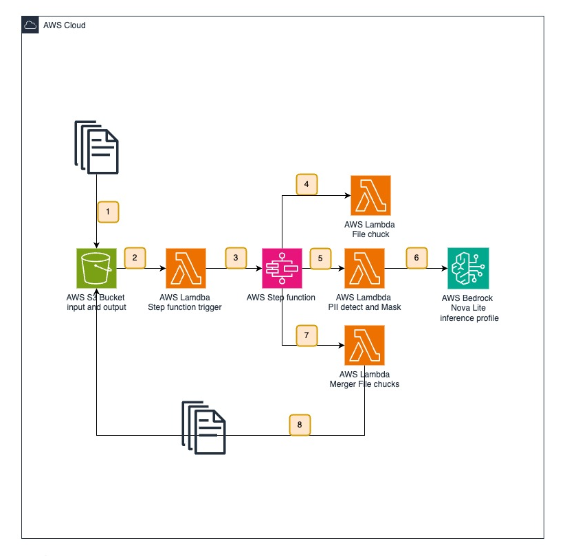

# PII Detection and Masking Workflow

Automated AWS solution for detecting and masking Personally Identifiable Information (PII) in CSV files using Step Functions, Lambda, and Amazon Bedrock.

## Architecture


### Workflow Overview

This solution is designed for batch processing CSV files containing sensitive information in the Comments field. The workflow efficiently handles large CSV files by:

1. **Initial Processing**
   - CSV files uploaded to `Newfile/` prefix trigger the workflow
   - The LoadCSVFunction divides large files into 100-row chunks for parallel processing
   - Each chunk is processed independently to optimize performance

2. **PII Detection and Masking**
   - Chunks are distributed across parallel Lambda functions
   - Each function uses Bedrock Nova-lite model to identify sensitive information
   - PII types like credit cards, names, emails, and addresses are masked with standardized tags
   - Built-in retry mechanisms handle API throttling and failures

3. **Results Consolidation**
   - Processed chunks are merged while maintaining original file structure
   - Additional columns in the CSV are preserved unchanged
   - Final output is saved with PII-masked comments in `Newoutputfile/` prefix
   - Original file format and integrity is maintained

This architecture ensures efficient processing of large files while maintaining data security and processing reliability.


## Prerequisites

- AWS Account
- Existing S3 bucket
- Access to Amazon Bedrock and Nova-lite model in us-east-1 region
- AWS CLI configured with appropriate permissions

## Deployment

1. Deploy the CloudFormation template:
```bash
aws cloudformation create-stack \
  --stack-name pii-detection-workflow \
  --template-body file://template.yaml \
  --parameters \
    ParameterKey=ExistingBucketName,ParameterValue=your-bucket-name \
    ParameterKey=RegionName,ParameterValue=us-east-1 \
  --capabilities CAPABILITY_IAM
```

## Usage

1. Upload CSV files to the `Newfile/` prefix in your S3 bucket
2. Files must contain a 'Comments' column for PII detection
3. Processed files appear in `Newoutputfile/` prefix
4. Monitor workflow in Step Functions console

## PII Detection Capabilities

Detects and masks:
- Credit card numbers
- Names
- Email addresses
- Physical addresses
- Phone numbers
- Bank account numbers
- Government IDs
- Dates of birth
- Geolocation data
- Account numbers
- Digital signatures
- Medical information

## Components

### Lambda Functions
- `NotificationFunction`: Configures S3 event notifications
- `StepFunctionsTrigger`: Initiates Step Functions workflow
- `LoadCSVFunction`: Processes CSV files in chunks
- `PIIDetectionFunction`: Performs PII detection using Bedrock
- `MergeResultsFunction`: Combines processed chunks

### State Machine
- Orchestrates the workflow with parallel processing
- Handles errors and retries
- Maximum concurrency of 8 for PII detection

## Error Handling

- Exponential backoff for API throttling
- Comprehensive error logging
- Failed state capture in Step Functions
- Maximum retries configured for Bedrock API calls

## Limitations

- Maximum file size: Determined by Lambda memory limits
- Processing time: 15-minute Lambda execution limit
- Region: Bedrock endpoint in us-east-1 only
- CSV format: Must include 'Comments' column

## Security

- IAM roles with least privilege access
- S3 bucket notifications restricted to specific prefix
- Encrypted data transfer
- Temporary credential management

## Monitoring

Monitor the workflow through:
- CloudWatch Logs
- Step Functions execution history
- Lambda execution metrics
- S3 event notifications

## Tags

All resources tagged with:
- genai: true
- PII: true
- prod: true